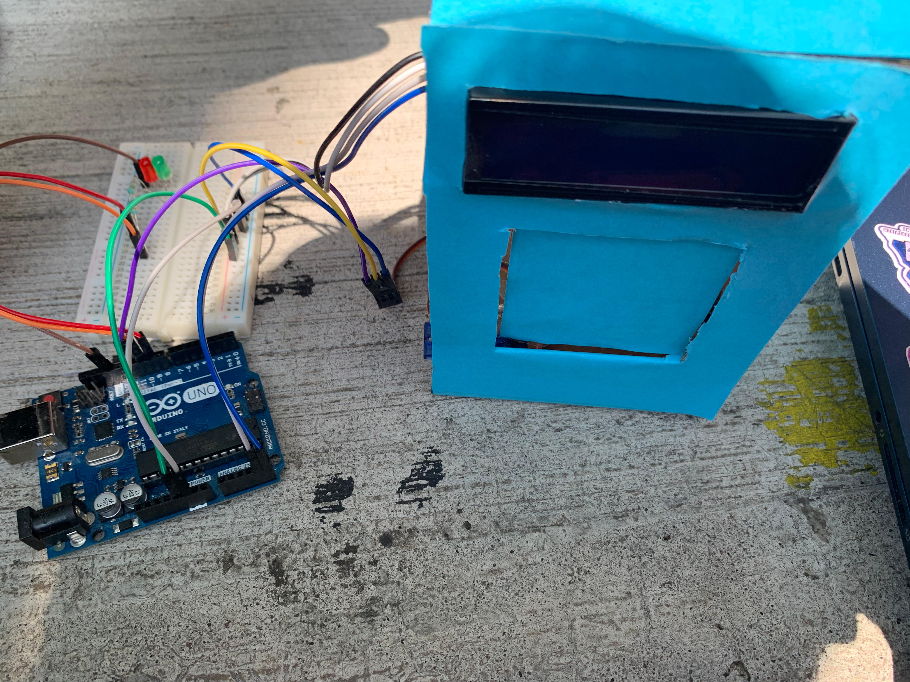

Sistema de Registro y Reconocimiento Facial con Python
-López Ramírez Joel Angel

Este proyecto implementa un sistema de registro facial utilizando Python, OpenCV, Dlib y la biblioteca Face Recognition. Permite registrar rostros de usuarios, almacenarlos codificados, y luego reconocerlos en tiempo real. Ideal como base para integraciones con Arduino o sistemas de autenticación.

Características

- Registro de nuevos usuarios con su rostro.
- Detección de rostro en tiempo real.
- Codificación facial con 'face_recognition'.
- Almacenamiento en archivo '.pickle'.
- Listo para integrarse con otros sistemas (ej. Arduino).

Tecnologías utilizadas

- Python 3.x
- OpenCV ('cv2')
- Dlib
- Face Recognition
- Pickle
- NumPy

Ejecución

1. Asegúrate de tener un entorno virtual con las dependencias instaladas.
2. Ejecuta el script registro_usuario.py.
3. Introduce el nombre del nuevo usuario cuando se solicite.
4. Pulsa la tecla g para guardar la imagen cuando el rostro sea detectado.
5. Confirma el registro desde la terminal.

Requisitos

Instala las dependencias necesarias con:

pip install opencv-python dlib face_recognition numpy

